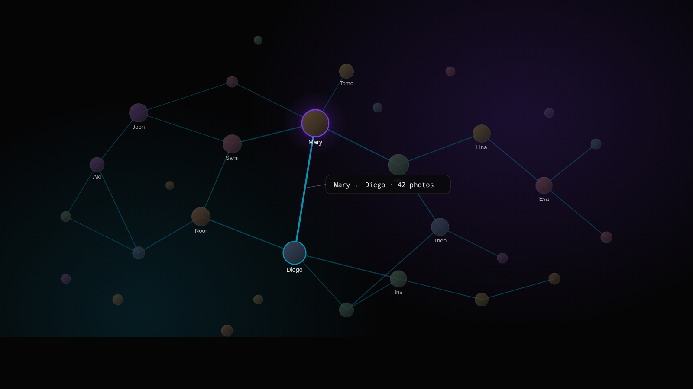

# Koram — Face Co-Occurrence Graph for Immich

Interactive force-directed graph of who appears in photos with whom, sourced from your Immich library's face recognition data. Self-hosted, exportable, no recognition.

[Landing page →](https://abcsds.github.io/Koram/)



## Features

- Per-person sweep of `/search/metadata` to build a co-occurrence matrix
- Force-directed layout with edge weight = photos containing both people
- Toggle between raw photo count and Jaccard similarity (client-side, no refetch)
- Drag to pin, double-click to unpin, scroll/pinch to zoom
- Per-face display override (thumbnail vs name)
- Export as PNG, CSV, or upload back to Immich into a dedicated "Koram Graphs" album

## Quick start

### Immich API key

Create one in Immich (Account → API Keys) with these permissions:

- `album.create`
- `album.read`
- `album.update`
- `asset.read`
- `asset.upload`
- `asset.view`
- `asset.download`
- `person.read`
- `person.statistics`
- `server.about`

### Docker Compose

```yaml
services:
  koram:
    image: koram:latest
    container_name: koram
    user: 1000:1000
    ports:
      - "5001:5001"
    environment:
      - IMMICH_API_KEY=your-api-key
      - IMMICH_BASE_URL=http://your-immich-host:2283
      # Optional. Public URL the frontend uses for deep links (Shift+click on a face).
      # Defaults to IMMICH_BASE_URL — only needed when that is an internal address.
      # - IMMICH_PUBLIC_URL=https://photos.example.com
    volumes:
      - ./config:/app/config
      - ./cache:/app/cache
    restart: always
```

Then open `http://your-server:5001`.

> No prebuilt image is published yet. Either build locally with `docker build -t koram .` from this repo, or replace `image:` with a `build: .` block in the Compose file.

### Configuration

Two equivalent ways to point Koram at Immich:

1. **Environment variables** — copy `.env.example` to `.env` and fill in `IMMICH_API_KEY` / `IMMICH_BASE_URL`, or pass them directly in your container.
2. **TOML file** — copy `config/koram.example.toml` to `config/koram.toml` (mounted at `/app/config/koram.toml` in the container).

If both are set, environment variables win. The file is auto-created with empty values on first run if absent.

### Volumes

| Path | Description |
|---|---|
| `/app/config` | `koram.toml` (auto-created on first run) |
| `/app/cache` | Co-occurrence result cache (one JSON per `(person_set, date_range)`) |

## Development

```bash
# Backend (port 5001)
IMMICH_API_KEY=xxx IMMICH_BASE_URL=http://your-server:2283 cargo run

# Frontend (port 5173, proxies /api to 5001)
cd frontend && npm install && npm run dev
```

Tests:

```bash
cargo test --lib                    # backend unit tests
cd frontend && npx vitest run       # frontend unit tests
```

## License

[MIT](LICENSE).
